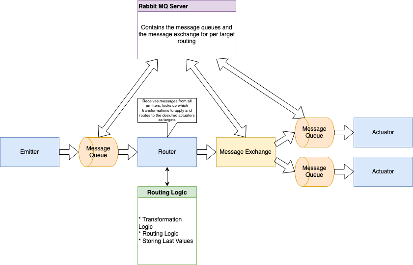

# FanController

Goal of this project is to implement an extensible system that reacts to input values and triggers actions in other systems. The system should be flexible to support various data emitters whose information should be processed as well as various actuators taking action based on the emitter values.

The system's core is the Router component that contains the transformation logic and relays the results to the actuators. Information flows through the system using message queues.

## Architecture Diagram:
Principle: using messages queues and exchanges to send data around.

Using a smart broker to route messages to the intended receivers (using RabbitMQ's Exchanges and Topics)



The Transformation logic is stored in a separate config file: it lets users define the transformation function by using a custom AST syntax as well as the targets for a given transformation. This flexibility moves the config outside the system and makes having an external config system possible.
The AST syntax supports Comparators, Math Operations, using the sent value as well as static values.

```json
{
    "type": "COMPARATOR_NODE",
    "comparator": "GREATER_EQUAL",
    "left": {
        "type": "MATH_NODE",
        "operator": "SUBTRACT",
        "left": {
            "type": "INPUT_NODE"
        },
        "right": {
            "type": "VALUE_NODE",
            "value": 18.0
        }
    },
    "right": {
        "type": "VALUE_NODE",
        "value": 5.0
    },
    "resultTrue": {
        "type": "VALUE_NODE",
        "value": 1.0
    },
    "resultFalse": {
        "type": "VALUE_NODE",
        "value": 0.0
    }
}
```

As [Go](https://go.dev/) does not allow for [inheritance](https://www.geeksforgeeks.org/inheritance-in-golang/), using [Polymorphism](https://en.wikipedia.org/wiki/Polymorphism_(computer_science)) is not as straightforward as in [Object-Oriented](https://www.techtarget.com/searchapparchitecture/definition/object-oriented-programming-OOP) languages such as [Java](https://www.java.com/en/). We currently need to pass a type field in each node of the function expression denoting the type to be able to emulate polymorphism in deserializing different Node types that each have different evaluation logic.

## Running the system
1. Start the RabbitMQ server: Docker RabbitMQ: ```docker run -d -p 5672:5672 --hostname fan-rabbit --name fan-rabbit rabbitmq:3```
2. Start the Router: ```cd router; go run router.go transformer.go types.go```
3. Start the Actuator: ```cd actuator; python actuator.py```
4. Start the Emitter: ```cd emitter; python emitter.py```

## Links:
* RabbitMQ: [https://www.rabbitmq.com](https://www.rabbitmq.com)
* Fan Motor: [https://www.amazon.de/dp/B0922N8MCR](https://www.amazon.de/dp/B0922N8MCR)
* Raspberry Pi GPIO: [https://www.elektronik-kompendium.de/sites/raspberry-pi/1907101.htm](https://www.elektronik-kompendium.de/sites/raspberry-pi/1907101.htm)
